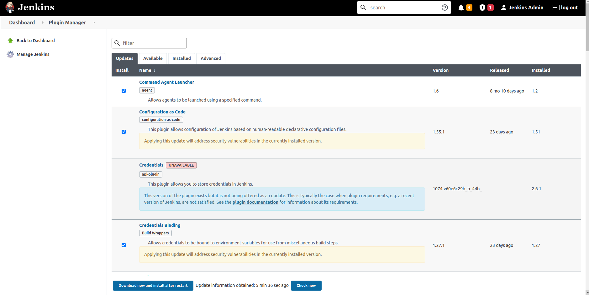

# Developers

This document collects some information about things developers of the gop should know or
problems they might face when they try to run and test their changes.
It provides workarounds or solutions for the given issues.

## Testing

There is an end to end testing script inside the `./scripts` folder. It scans for builds and starts them, waits until their finished or fail and returns the result.

### Usage

You can use it by executing `groovy ./scripts/e2e.groovy --url http://localhost:9090 --user admin --password admin`

### Options

- `help` - Print this help text and exit
- `url` - The Jenkins-URL to connect to
- `user`- The Jenkins-User for login
- `password` - Jenkins-Password for login
- `fail` - Exit on first build failure
- `interval` - Interval for waits while scanning for builds
- `debug` - Set log level to debug

## Jenkins plugin installation issues

We have had some issues with jenkins plugins in the past due to the installation of the latest versions.
Trying to overcome this issue we pinned all plugins within `scripts/jenkins/plugins/plugins.txt`.
These pinned plugins get downloaded within the docker build and saved into a folder as `.hpi` files. Later on
when configuring jenkins, we upload all the plugin files with the given version.

Turns out it does not completely circumvent this issue. In some cases jenkins updates these plugins automagically (as it seems) when installing the pinned version fails at first.
This again may lead to a broken jenkins, where some of the automatically updated plugins have changes within their dependencies. These dependencies than again are not updated but pinned and may cause issues.

Since solving this issue may require some additional deep dive into bash scripts we like to get rid of in the future, we decided to give some hints how to easily solve the issue (and keep the plugins list up to date :]) instead of fixing it with tremendous effort.

### Solution

* Determine the plugins that cause the issue
  * inspecting the logs of the jenkins-pod
  * jenkins-ui (http://localhost:9090/manage)


* Fix conflicts by updating the plugins with compatible versions
  * Update all plugin versions via jenkins-ui (http://localhost:9090/pluginManager/) and restart



* Verify the plugin installation
  * Check if jenkins starts up correctly and builds all example pipelines successfully
  * verify installation of all plugins via jenkins-ui (http://localhost:9090/script) executing the following command


```groovy
Jenkins.instance.pluginManager.plugins.collect().sort().each {
  println "${it.shortName}:${it.version}"
}
```

* Share and publish your plugin updates
  * Make sure you have updated `plugins.txt` with working versions of the plugins
  * commit and push changes to your feature-branch and submit a pr

## Local development

* Run only groovy scripts - allows for simple debugging
  * Run from IDE, works e.g. with IntelliJ IDEA 
    Note: If you encounter `error=2, No such file or directory`,
    it might be necessary to explicitly set your `PATH` in Run Configuration's Environment Section.
  * From shell:
    * [Provide dependencies](#providing-dependencies)
    * Run
      ```shell
       groovy  -classpath src/main/groovy src/main/groovy/com/cloudogu/gitops/cli/GitopsPlaygroundCliMain.groovy
       ```
* Running the whole `apply.sh` (which in turn calls groovy)
  * Build and run dev Container:
    ```shell
    docker buildx build -t gitops-playground:dev --build-arg ENV=dev  --progress=plain .
    docker run --rm -it -u $(id -u) -v ~/.k3d/kubeconfig-gitops-playground.yaml:/home/.kube/config \
      --net=host gitops-playground:dev <params>
     ```
  * Locally:
    * [Provide dependencies](#providing-dependencies)
    * Just run `scripts/apply.sh <params>`

### Providing dependencies

It seems like `groovy --classpath gitops-playground-cli-*.jar` [does not load jars]( https://stackoverflow.com/questions/10585808/groovy-script-classpath),
Workaround:

* Run
  ```shell
  mvn package -DskipTests
  ```
* Copy `target/gitops-playground-cli-*.jar` to `~/.groovy/lib`
* Make sure to use the exact same groovy version as in pom.xml
  To avoid
  ```
  Caused by: groovy.lang.GroovyRuntimeException: Conflicting module versions. Module [groovy-datetime is loaded in version 3.0.8 and you are trying to load version 3.0.13
  ```
  Solution might be to remove groovy from `gitops-playground-cli-*.jar`


## Development image

An image containing groovy and the JDK for developing inside a container or cluster is provided for all image version
with a `-dev` suffix.

e.g.
* ghcr.io/cloudogu/gitops-playground:dev
* ghcr.io/cloudogu/gitops-playground:latest-dev
* ghcr.io/cloudogu/gitops-playground:d67ec33-dev

It can be built like so:

```shell
docker buildx build -t gitops-playground:dev --build-arg ENV=dev  --progress=plain  .  
```
Hint: uses buildkit for much faster builds, skipping the static image stuff not needed for dev.

TODO: Copy a script `apply-ng` into the dev image that calls `groovy GitopsPlaygroundCliMain?! args`.
Then, we can use the dev image to try out if the playground image works without having to wait for the static image to
be built.

## Implicit explicit dependencies

The GitOps Playground comprises a lot of software components. The versions of some of them are pinned within this 
repository so need to be upgraded regularly.

* Kubernetes [in Terraform](../terraform/vars.tf) and locally [k3d](../scripts/init-cluster.sh),
* [k3d](../scripts/init-cluster.sh), [Upgrade to v5 WIP](https://github.com/cloudogu/gitops-playground/tree/feature/k3d-version5) 
* [Groovy libs](../pom.xml) + [Maven](../.mvn/wrapper/maven-wrapper.properties)
* Installed components
  * Jenkins 
    * Helm Chart 
    * Plugins
    * Pod `tmp-docker-gid-grepper`
    * `dockerClientVersion`
    * Init container `create-agent-working-dir`
    * Agent Image
  * SCM-Manager Helm Chart + Plugins
  * Docker Registry Helm Chart
  * GitOps Operators
    * ArgoCD Helm Chart
    * Flux v1 + v2 Helm Charts
  * Grafana + Prometheus [Helm Charts](../src/main/groovy/com/cloudogu/gitops/ApplicationConfigurator.groovy)
  * Vault + ExternalSerets Operator [Helm Charts](../src/main/groovy/com/cloudogu/gitops/ApplicationConfigurator.groovy)
* Applications
  * GitOps-build-lib + `buildImages`
  * ces-build-lib
  * Spring PetClinic
  * NGINX Helm Chart
* Dockerfile
  * Alpine
  * GraalVM
  * JDK
  * Groovy
  * musl & zlib
  * Packages installed using apk, gu, microdnf

## Upgrade Flux

```shell
  PW=admin
flux bootstrap git \
  --url=http://localhost:9091/scm/repo/fluxv2/gitops \
  --allow-insecure-http=true \
  --branch=main \
  --path=./clusters/gitops-playground \
  --token-auth \
  --username=admin \
  --password=${PW} \
  --interval=10s
# Once we have webhooks setup we no longer need this short interval
```

Then 
* replace contents in `fluxv2/clusters/gitops-playground/flux-sysmtem` by the one in http://localhost:9091/scm/repo/fluxv2/gitops
* In `gotk-sync.yaml` 
  * update url to http://scmm-scm-manager.default.svc.cluster.local/scm/repo/fluxv2/gitops
  * Set `--interval=10s` in kustomization

In case of error
```shell
flux uninstall
```
